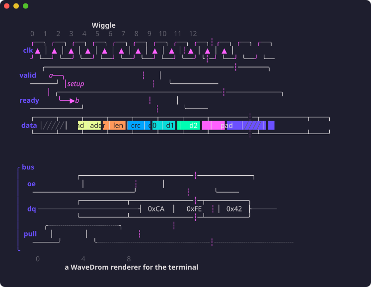

# Wiggle

Render [WaveDrom](https://wavedrom.com) timing diagrams in your terminal.



Built on [Bubble Tea](https://github.com/charmbracelet/bubbletea),
[Lip Gloss](https://github.com/charmbracelet/lipgloss) and
[Glamour](https://github.com/charmbracelet/glamour). Reads the same relaxed
WaveJSON that WaveDrom does, follows its rendering rules, and works as a
CLI, an interactive viewer, a Markdown filter, or a Go library.

## Install

```sh
go install github.com/joaofbmaia/wiggle/cmd/wiggle@latest
```

Prebuilt binaries for Linux, macOS and Windows are on the
[releases page](https://github.com/joaofbmaia/wiggle/releases).

## Usage

```sh
$ cat spi.json5
{ signal: [
  { name: "clk",  wave: "P......" },
  { name: "bus",  wave: "x.==.=x", data: ["head", "body", "tail", "data"] },
  { name: "wire", wave: "0.1..0." }
]}

$ wiggle -p spi.json5
     ╭──╮  ╭──╮  ╭──╮  ╭──╮  ╭──╮  ╭──╮  ╭──╮
 clk ▲  │  ▲  │  ▲  │  ▲  │  ▲  │  ▲  │  ▲  │
     ╯  ╰──╯  ╰──╯  ╰──╯  ╰──╯  ╰──╯  ╰──╯  ╰──
     ╭───────────┬─────┬───────────┬─────┬────╮
 bus │╱╱╱╱╱╱╱╱╱╱╱│head │   body    │tail │╱╱╱╱│
     ╰───────────┴─────┴───────────┴─────┴────╯
                 ╭─────────────────╮
wire             │                 │
     ────────────╯                 ╰───────────
```

Without `-p`, `wiggle spi.json5` opens a viewer: scroll, `+`/`-` zoom,
`a` ASCII, `f` bus fill, `?` help. Piped output is plain text; colors
follow `NO_COLOR` and `CLICOLOR_FORCE`.

| Flag | |
| --- | --- |
| `-w N` | columns per cycle (default 6, times `config.hscale`) |
| `--ascii` | ASCII only |
| `--sharp` | square corners |
| `--flat` | outline buses instead of filling them |
| `-p` | print, don't open the viewer |

### Markdown

`wiggle md doc.md` renders Markdown with Glamour and draws fenced
` ```wavedrom ` (or ` ```wavejson `) blocks as diagrams. Parse errors are
reported inline.

## Library

```go
import (
    "github.com/joaofbmaia/wiggle"
    "github.com/joaofbmaia/wiggle/wavejson"
)

d, err := wavejson.Parse(src)
out := wiggle.Render(d, wiggle.Options{})
lipgloss.Println(out) // downsamples colors for the terminal
```

`Options` takes a `*Glyphs` (`Rounded`, `Sharp`, `ASCII`) and a `*Theme`
(`DefaultTheme(dark)`, `FlatTheme(dark)`, `PlainTheme()`). Package `tui`
is an embeddable Bubble Tea model; package `markdown` splits documents at
wavedrom fences for Glamour-based tools.

## Examples

[`examples/`](examples/) is a rendered gallery: protocols (`spi`, `i2c`,
`uart`, `axi-handshake`, `sram`, `ddr`), a `pipeline`, every wave character
(`states`), every arrow style (`edges`), and each step of the
[WaveDrom tutorial](examples/tutorial/).

## License

[MIT](LICENSE)
