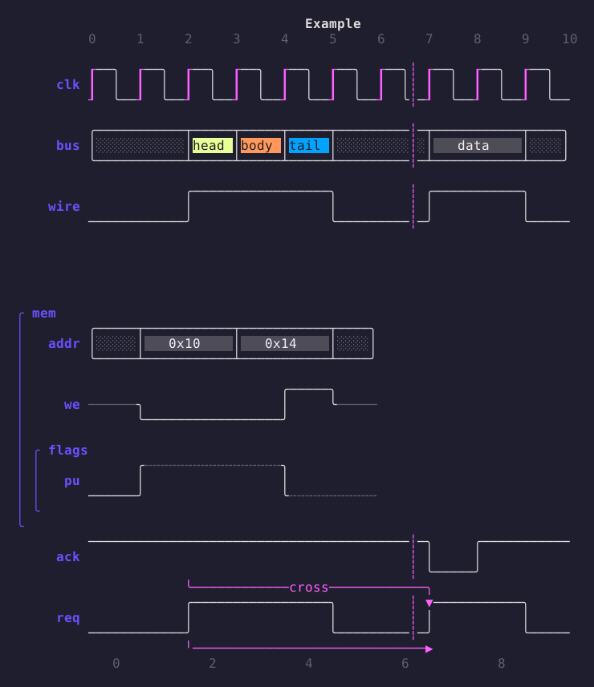

# wiggle

WaveDrom timing diagrams, rendered in the terminal with the
[Charm](https://charm.land) stack: Bubble Tea, Bubbles and Lip Gloss.



- Reads the same relaxed WaveJSON that WaveDrom accepts (unquoted keys,
  single quotes, trailing commas, comments).
- Signals, clocks with marked edges, buses with colored labels, undefined and
  high-impedance states, pull-up/pull-down, time breaks, nested groups,
  head/foot titles and tick numbering, node-to-node edges with labels.
- Adaptive light/dark theme; Unicode box drawing with an ASCII fallback.
- Interactive viewer with scrolling and zoom, or plain output when piped.
- `wiggle md` renders Markdown with Glamour and draws ```` ```wavedrom ````
  fences as diagrams.
- Importable: a `Render` function and a Bubble Tea model you can embed.

## Install

```sh
go install github.com/joaofbmaia/wiggle/cmd/wiggle@latest
```

## Usage

```sh
wiggle diagram.json5          # interactive viewer
wiggle diagram.json5 | less   # plain text when piped
wiggle -p --ascii spi.json    # print, ASCII only
cat spi.json | wiggle
wiggle md README.md           # Markdown with wavedrom fences
```

Flags:

| Flag | Effect |
| --- | --- |
| `-w, --width N` | columns per cycle (default 6, multiplied by `config.hscale`) |
| `--ascii` | ASCII glyphs only |
| `--sharp` | square corners instead of rounded |
| `--flat` | outline bus segments instead of filling them |
| `-p, --plain` | print instead of opening the viewer |
| `md --wrap N` | Markdown word-wrap width (default 80) |
| `md --style S` | Glamour style name or JSON file (`$GLAMOUR_STYLE`) |

Colors follow `NO_COLOR`, `CLICOLOR_FORCE` and the terminal's capabilities.

Viewer keys: arrows or `hjkl` scroll, `+`/`-` zoom, `a` ASCII, `f` toggle bus
fill, `g`/`G` top/bottom, `?` help, `q` quit.

## Examples

`examples/` has ready-made diagrams: `spi`, `i2c`, `uart`, `axi-handshake`,
`sram`, `ddr` (period/phase), `pipeline` (groups), `gaps` (time breaks),
`edges` (every arrow style), `states` (every wave character) and
`README-demo.md` for `wiggle md`.

```sh
for f in examples/*.json5; do wiggle -p "$f"; done
```

## Markdown

````markdown
```wavedrom
{ signal: [
  { name: 'clk', wave: 'p....' },
  { name: 'dat', wave: 'x.==x', data: ['a', 'b'] },
]}
```
````

`wiggle md file.md` splits the document at `wavedrom`/`wavejson` fences,
renders the Markdown parts with Glamour and the fences with wiggle, aligned to
Glamour's code block margin. Diagrams that fail to parse are reported inline
without failing the document.

## Library

```go
import (
    "github.com/joaofbmaia/wiggle"
    "github.com/joaofbmaia/wiggle/wavejson"
)

d, err := wavejson.Parse(src)
out := wiggle.Render(d, wiggle.Options{Width: 8})
lipgloss.Println(out) // downsample colors for the terminal
```

`wiggle.Options` takes a `*Glyphs` (`Rounded`, `Sharp`, `ASCII`) and a
`*Theme` (`DefaultTheme(dark)`, `FlatTheme(dark)`, `PlainTheme()`, or your
own). Output is truecolor ANSI; write it through `lipgloss.Print` or a
`colorprofile.Writer`, or hand it to Bubble Tea which downsamples for you.

To embed the viewer in a Bubble Tea program:

```go
import "github.com/joaofbmaia/wiggle/tui"

m := tui.New("title", wiggle.Options{}, tui.Diagram{D: d}, tui.Text(rendered))
```

`tui.Model` implements `tea.Model`; call `SetSize` when your layout changes
and forward messages to `Update`. It requests the terminal background color
on `Init` and switches theme accordingly.

The `markdown` package exposes `Split`, `NewRenderer` and `Render` for
integrating diagrams into other Glamour-based tools such as
[glow](https://github.com/charmbracelet/glow).

## Wave characters

| Char | Meaning |
| --- | --- |
| `0` `1` `l` `h` | low / high |
| `L` `H` | low / high with an emphasized edge |
| `p` `n` `P` `N` | positive / negative clock, capital marks the active edge |
| `.` | repeat previous |
| `\|` | repeat previous with a time break |
| `x` | undefined |
| `z` | high impedance |
| `u` `d` | pull-up / pull-down |
| `=` `2`–`9` | bus segment with a label from `data`, colored by digit |

`period`, `phase`, `node`, `edge`, `head`, `foot`, `config.hscale` and nested
groups behave as in WaveDrom. `reg` and `assign` diagrams are not supported.

## License

MIT
