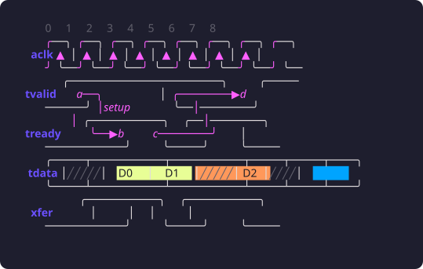
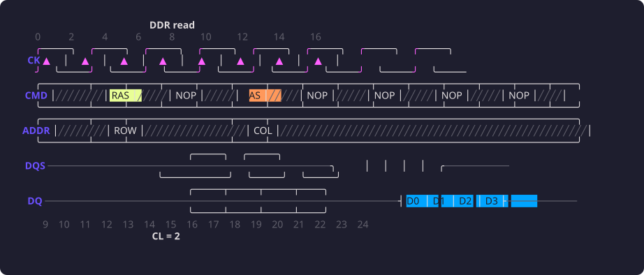
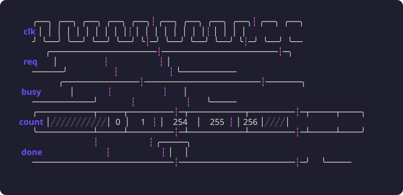
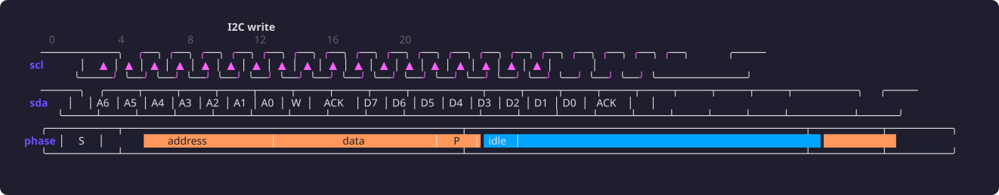
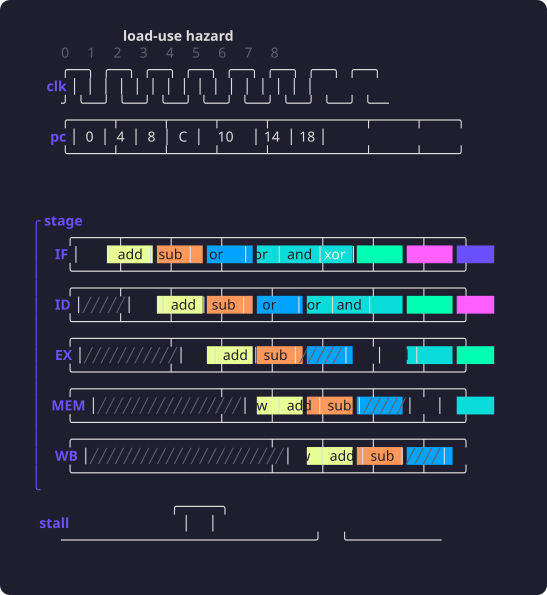
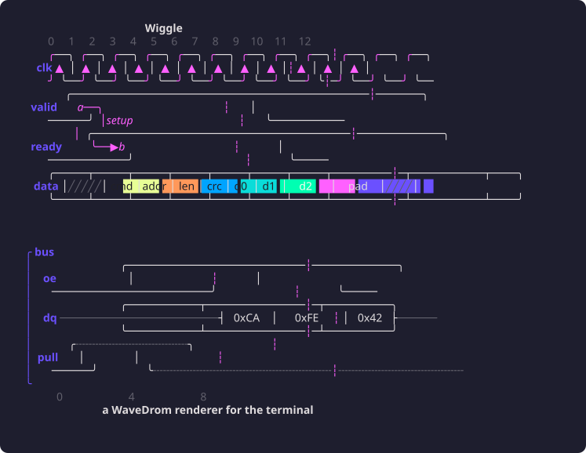
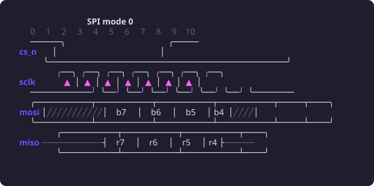
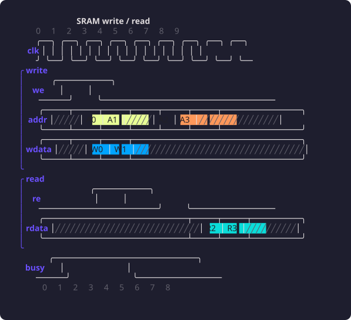
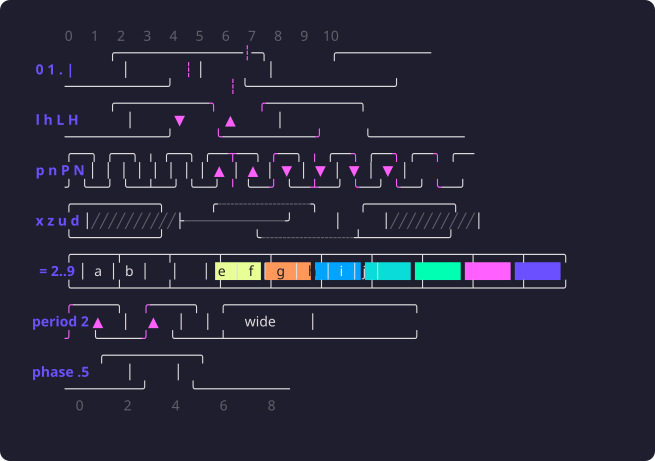
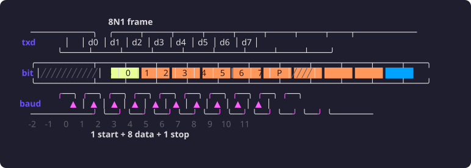

# Examples

Each diagram rendered with `wiggle -p`, captured by [`docs/shot.sh`](../docs/shot.sh). The [tutorial](tutorial/) folder has every step of the WaveDrom tutorial.

## axi-handshake

AXI-style valid/ready handshake with back-pressure and a wait state.

## ddr

DDR read: command on the rising edge, data on both edges of DQS.

## edges

The WaveDrom edge tutorial: every arrow style.

## gaps

Time breaks: a long transaction with the boring middle cut out.

## i2c

I2C start, address byte, ACK, one data byte, stop.

## pipeline

Classic 5-stage pipeline with a load-use stall.

## showcase

A little of everything: the README picture.

## spi

SPI mode 0: MOSI/MISO sampled on the rising edge of SCLK.

## sram

Synchronous SRAM: two writes then two reads, one cycle latency.

## states

Every wave character in one place.

## uart

8N1 UART frame: start bit, LSB-first data, stop bit.

