# WaveDrom tutorial

The examples from [wavedrom.com/tutorial.html](https://wavedrom.com/tutorial.html), rendered by wiggle.

## 1-signal

Step 1. The Signal

## 2-clock

Step 2. Adding Clock

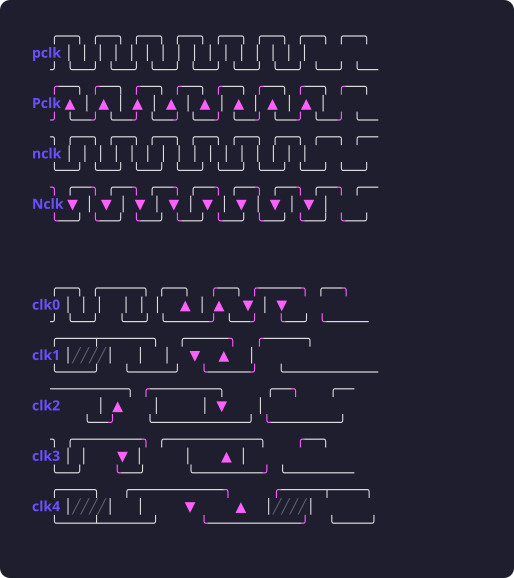

## 3-together

Step 3. Putting all together

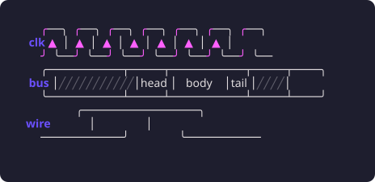

## 4-gaps

Step 4. Spacers and Gaps

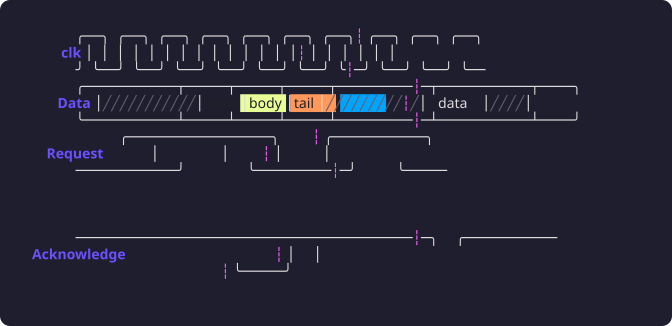

## 5-groups

Step 5. The groups

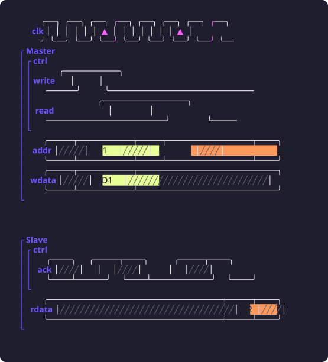

## 6-period-phase

Step 6. Period and Phase: DDR read transaction

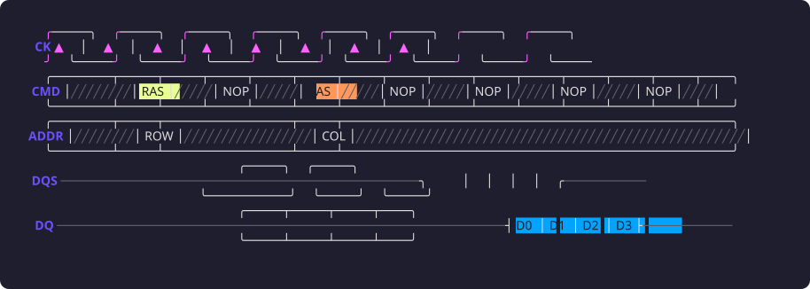

## 7a-hscale

Step 7. config.hscale

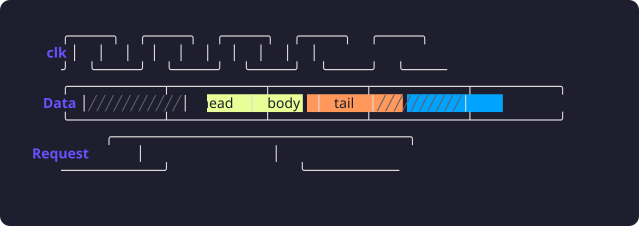

## 7b-head-foot

Step 7. head / foot

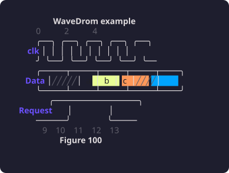

## 7c-text

Step 7. head / foot text as JsonML (tspan styling is flattened to plain text)

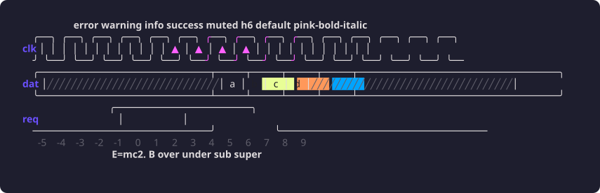

## 8a-splines

Step 8. Arrows: splines  ~ -~ <~> <-~> ~> -~> ~->

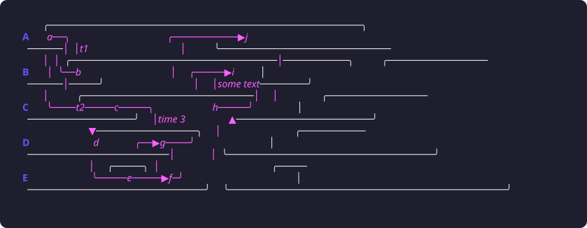

## 8b-sharp

Step 8. Arrows: sharp lines  - -| -|- <-> <-|> <-|-> -> -|> -|-> |-> +

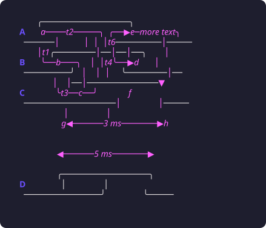

## 9-code

Step 9. Some code: the tutorial builds this Gray counter with JavaScript;

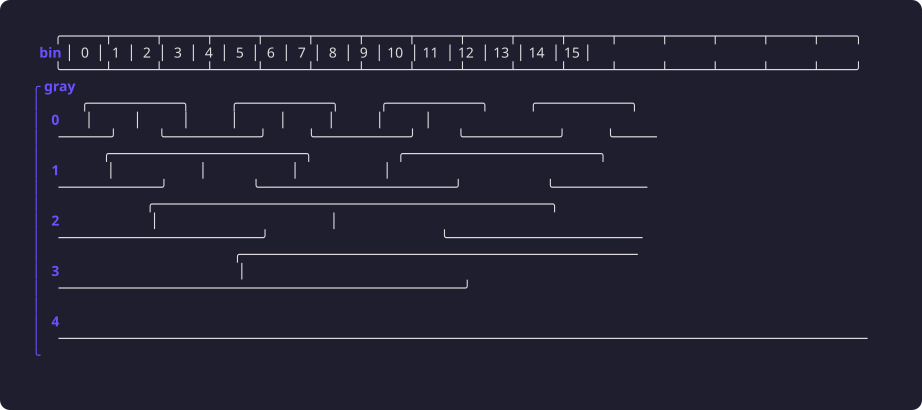
